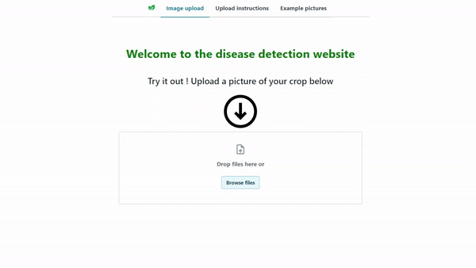

# Plant disease labeling pipeline on AWS
### Context
This project is a **serverless** application built entirely on **AWS**. It detects crop and disease type and allows the labeling correction of the disease and crop types by agriculture specialists. The goal of the labeling pipeline is to enhance the training dataset with quality images that are correctly annoted by field specialists.

### Walk-through demo

#### Sign-in / sign-up page

Create an account by providing email and password. This step uses **Amazon Cognito** for authentication and authorization.
#### Welcome page

This page contains some upload instructions, example photos, and a file uploader.
#### Image Upload

Upload a JPG image with respect to the upload instructions. **AWS Rekognition** will detect if the uploaded image is a leaf or not. Generating predictions is only possible if the uploaded image is a leaf.
#### Predictions

Click on the "Predict" button to run inference on a **SageMaker** Endpoint, which hosts a Machine Learning model that will generate predictions (bounding boxes and crop disease type).
#### Correct disease class

Click on "No" button to correct the disease class and crop type if the predictions are incorrect. 
#### Correct bounding boxes

Click on "Draw bounding boxes" to correct the bounding boxes generated by the ML model. Click "Done" when you are satisfied with your drawing.

### AWS Services 
- Amazon SageMaker
- Amazon S3
- API Gateway
- AWS Lambda
- AWS Rekognition
- Amplify

